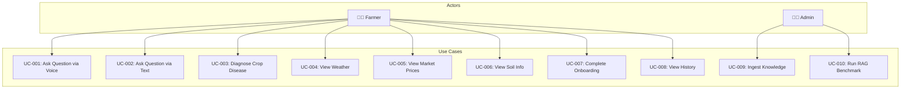

# Software Requirements Specification (SRS)
## KrishiMitra — AI-Powered Organic Farming Assistant for Karnataka
**Document ID:** KM-SRS-001 | **Version:** 2.0 | **Date:** 2026-05-05  
**Author:** Mohammed Shakeeb | **Organization:** Nivetti Systems  
**Confidentiality:** Internal — Nivetti Systems

---

## 1. Executive Summary

KrishiMitra is a voice-first, AI-powered mobile application designed to provide verified organic farming guidance to Karnataka farmers in Kannada. The system uses Retrieval-Augmented Generation (RAG) to ensure all responses are grounded in verified agricultural sources (ICAR, NIPHM, Subhash Palekar ZBNF), eliminating hallucination risk inherent in pure LLM systems.

**Primary Beneficiary:** Smallholder organic farmers in Karnataka's 31 districts across 10 agro-climatic zones.

## 2. Stakeholder Analysis

| Stakeholder | Role | Needs |
|---|---|---|
| Karnataka Farmers | End User | Kannada voice interaction, verified organic guidance, disease diagnosis |
| Nivetti Systems (CEO) | Product Owner | Demonstrable AI product, investor-ready demo, scalability |
| Development Team | Implementer | Clear requirements, modular architecture, testable components |
| KVK (Krishi Vigyan Kendra) | Domain Expert | Scientifically accurate content, proper source citation |
| ICAR/NIPHM | Knowledge Source | Proper attribution, content integrity |

## 3. Functional Requirements

### 3.1 Core Features (Phase 1 — Delivered)

| ID | Requirement | Priority | Status |
|----|------------|----------|--------|
| FR-001 | Voice input in Kannada via Sarvam AI STT | P0 | ✅ Done |
| FR-002 | Text input fallback for queries | P0 | ✅ Done |
| FR-003 | RAG-grounded response generation from verified corpus | P0 | ✅ Done |
| FR-004 | Kannada TTS audio response playback | P0 | ✅ Done |
| FR-005 | Source citation in every response | P0 | ✅ Done |
| FR-006 | Chemical input hard-block (Urea, DAP, NPK, pesticides) | P0 | ✅ Done |
| FR-007 | Image-based crop disease diagnosis via Pixtral-12b | P0 | ✅ Done |
| FR-008 | Multi-turn conversation with history | P1 | ✅ Done |
| FR-009 | Farmer onboarding (name, district, crops) | P1 | ✅ Done |
| FR-010 | Session history with persistence | P1 | ✅ Done |
| FR-011 | KVK redirect for low-confidence queries | P1 | ✅ Done |
| FR-012 | Confidence scoring with multi-source validation | P1 | ✅ Done |

### 3.2 Integration Features (Phase 2 — Current Sprint)

| ID | Requirement | Priority | Status |
|----|------------|----------|--------|
| FR-013 | Real-time weather for Karnataka districts (Open-Meteo) | P1 | ✅ Done |
| FR-014 | Agriculture weather (soil temp, moisture, ET, tips) | P1 | ✅ Done |
| FR-015 | Soil data integration (SoilGrids ISRIC + local zones) | P1 | ✅ Done |
| FR-016 | Live market/mandi prices for Karnataka crops | P1 | ✅ Done |
| FR-017 | Home screen widgets (weather, market, soil) | P1 | ✅ Done |
| FR-018 | District-level + searchable weather lookup | P2 | ✅ Done |

### 3.3 Future Features (Phase 3 — Planned)

| ID | Requirement | Priority |
|----|------------|----------|
| FR-019 | Multi-language support (Tamil, Telugu, Hindi) | P2 |
| FR-020 | Crop calendar with seasonal alerts | P2 |
| FR-021 | Community forum for farmer-to-farmer knowledge | P3 |
| FR-022 | Integration with government schemes (PM-KISAN, KCC) | P3 |
| FR-023 | Offline mode with cached responses | P2 |

## 4. Non-Functional Requirements

| ID | Category | Requirement | Target |
|----|----------|------------|--------|
| NFR-001 | Performance | Query response time | < 15 seconds (STT+RAG+LLM+TTS) |
| NFR-002 | Performance | App startup time | < 3 seconds |
| NFR-003 | Availability | Backend uptime | 99% during business hours |
| NFR-004 | Security | API keys not in client | All keys server-side only |
| NFR-005 | Security | Chemical filter bypass | Zero tolerance |
| NFR-006 | Localization | UI language | Kannada (primary), English (labels) |
| NFR-007 | Accessibility | Font size minimum | 16sp (elderly farmer consideration) |
| NFR-008 | Reliability | Timeout handling | 45s hard cap on query pipeline |
| NFR-009 | Data Integrity | RAG similarity threshold | 0.60 minimum for response delivery |
| NFR-010 | Scalability | Concurrent users | 50 simultaneous (Phase 1 target) |

## 5. Use Case Diagrams

## 6. User Stories

| Story ID | As a... | I want to... | So that... | Acceptance Criteria |
|----------|---------|-------------|-----------|-------------------|
| US-001 | Farmer | Ask a question by speaking in Kannada | I get verified organic farming advice | STT transcribes, RAG retrieves, LLM responds in Kannada, TTS plays |
| US-002 | Farmer | Take a photo of my diseased crop | I get diagnosis and organic treatment | Image analyzed, disease identified, organic remedies provided |
| US-003 | Farmer | See today's weather for my district | I can plan farming activities | Current temp, humidity, 7-day forecast displayed |
| US-004 | Farmer | Check mandi prices for my crops | I can decide when to sell | Latest prices with min/max/modal shown |
| US-005 | Farmer | Know my soil deficiencies | I can apply correct organic inputs | Zone data with deficiencies and recommendations shown |
| US-006 | Admin | Add new knowledge documents | The AI has more information | PDF/YouTube ingested, chunked, embedded, stored |

## 7. Glossary

| Term | Definition |
|------|-----------|
| **ZBNF** | Zero Budget Natural Farming — Subhash Palekar's organic farming methodology |
| **Jeevamrutha** | Fermented liquid organic fertilizer (cow dung + urine + jaggery + flour + soil) |
| **KVK** | Krishi Vigyan Kendra — Government agricultural extension center |
| **APMC** | Agricultural Produce Market Committee — regulated market (mandi) |
| **RAG** | Retrieval-Augmented Generation — AI pattern grounding responses in retrieved documents |
| **pgvector** | PostgreSQL extension for vector similarity search |
| **STT/TTS** | Speech-to-Text / Text-to-Speech |
| **ICAR** | Indian Council of Agricultural Research |
| **NIPHM** | National Institute of Plant Health Management |
