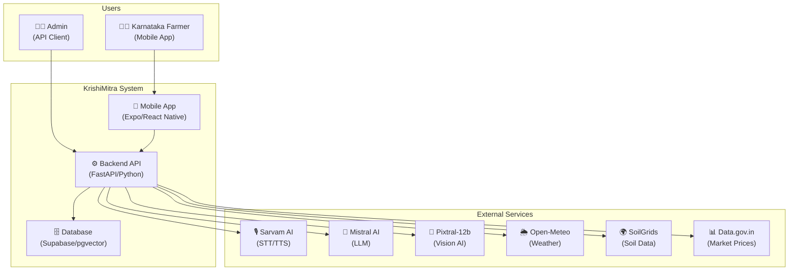
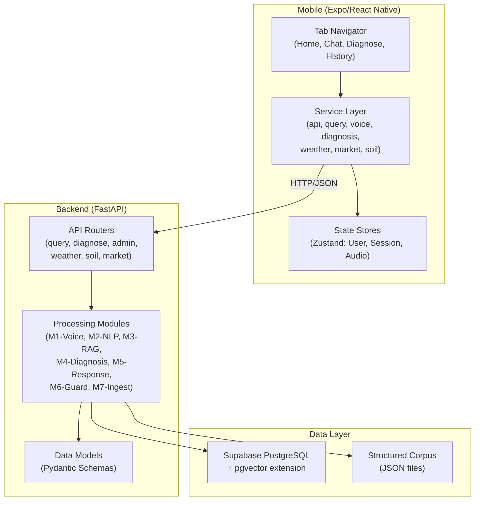
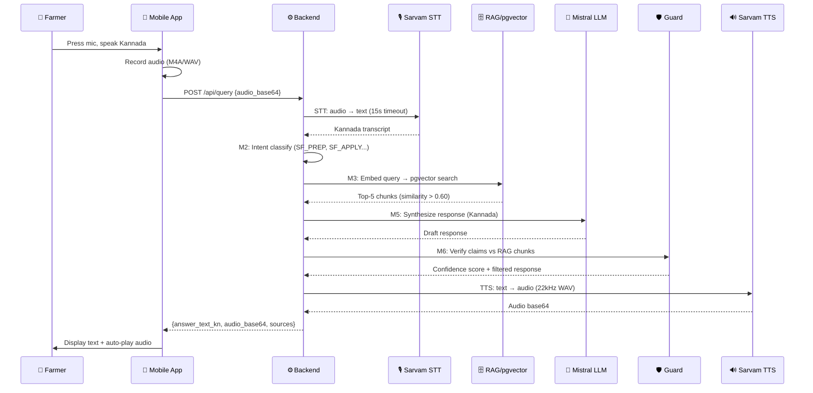
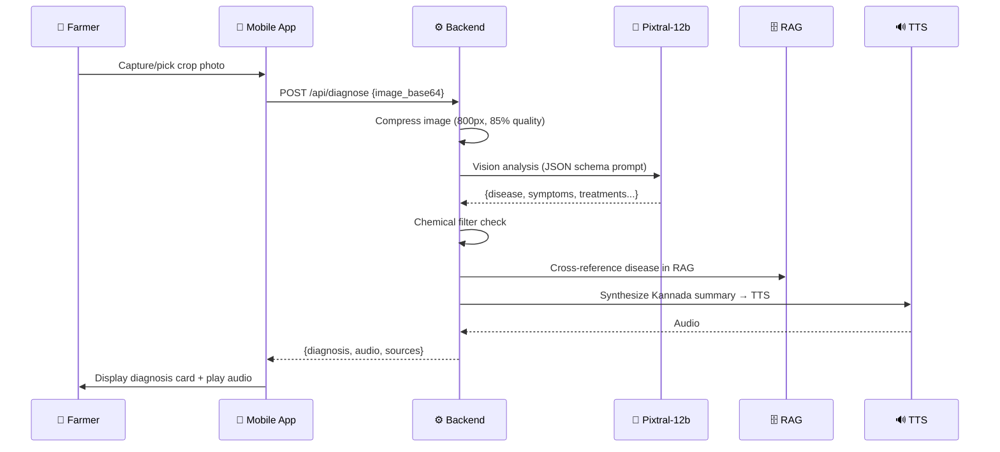
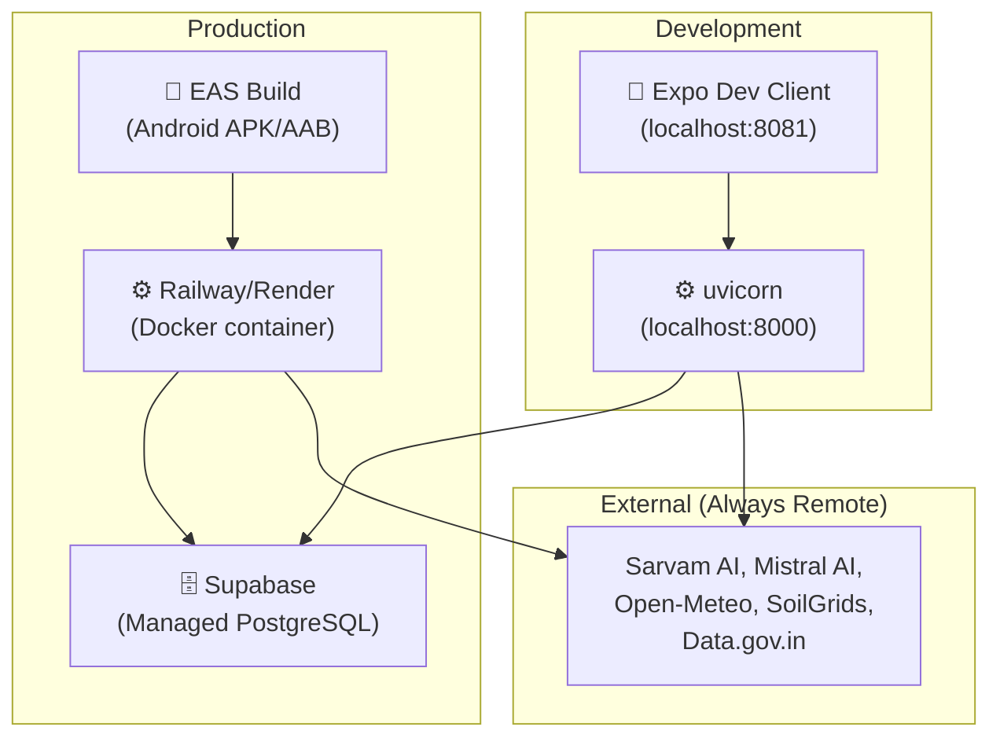

# High-Level Design (HLD)
## KrishiMitra — System Architecture Document
**Document ID:** KM-HLD-001 | **Version:** 2.0 | **Date:** 2026-05-05  
**Author:** Mohammed Shakeeb | **Organization:** Nivetti Systems

---

## 1. System Context (C4 Level 1)

## 2. Container Diagram (C4 Level 2)

## 3. Technology Stack Rationale

| Layer | Technology | Why Chosen | Alternatives Considered |
|-------|-----------|-----------|------------------------|
| **Mobile** | Expo/React Native | Cross-platform, rapid iteration, Expo Go for testing | Flutter (steeper learning curve), Native (2x dev time) |
| **Backend** | FastAPI (Python) | Async support, auto-docs, ML ecosystem compatibility | Node.js (weaker ML), Django (slower async) |
| **Database** | Supabase + pgvector | Free tier, PostgreSQL power, vector search built-in | Pinecone (costly), Weaviate (complex self-host) |
| **Voice STT** | Sarvam AI | Best Kannada accuracy, Indian language specialist | Google STT (poor Kannada), Whisper (needs GPU) |
| **Voice TTS** | Sarvam Bulbul v3 | Natural Kannada voice, 22kHz quality | Google TTS (robotic), Azure (expensive) |
| **LLM** | Mistral Small | Cost-effective, good multilingual, fast inference | GPT-4 (expensive), Gemini (quota issues) |
| **Vision** | Pixtral-12b | Strong plant image classification, good JSON output | Gemini Vision (quota), GPT-4V (expensive) |
| **Embeddings** | sentence-transformers/paraphrase-multilingual-mpnet-base-v2 | Multilingual, 768-dim, Kannada-English cross-lingual | OpenAI embeddings (API cost per call) |
| **State Mgmt** | Zustand | Lightweight, no boilerplate, AsyncStorage persistence | Redux (verbose), Context API (re-render issues) |
| **Weather** | Open-Meteo | Free, no key, agriculture data, global coverage | OpenWeatherMap (1K/day limit), Visual Crossing |
| **Soil** | SoilGrids ISRIC | Free, 250m resolution, comprehensive properties | ISRO Bhuvan (complex), Soil Health Card (no API) |
| **Market** | Data.gov.in + curated | Official government data, free API | Agmarknet (no API), private APIs (cost) |

## 4. Data Flow — Voice Query Pipeline

## 5. Data Flow — Disease Diagnosis Pipeline

## 6. Deployment Architecture

## 7. Network & Security Architecture

| Concern | Implementation |
|---------|---------------|
| **API Keys** | Server-side only (.env), never sent to client |
| **CORS** | Configured for mobile app origin (restrict in production) |
| **Input Validation** | Pydantic schemas on all endpoints |
| **Chemical Block** | Hard filter in M4_confidence_guard + M5_response |
| **Timeout Protection** | 45s hard cap on full pipeline, 15s per external call |
| **Data Privacy** | Farmer profile stored on-device only (AsyncStorage), not on server |
| **Audio Cleanup** | Temporary audio files deleted after processing |
| **Rate Limiting** | External API caching (1hr weather, 24hr soil, 6hr market) |
