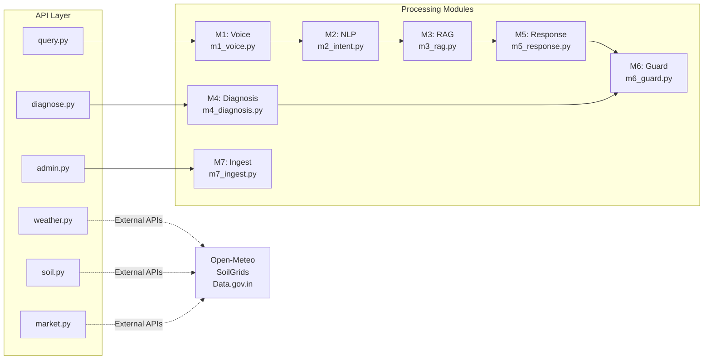
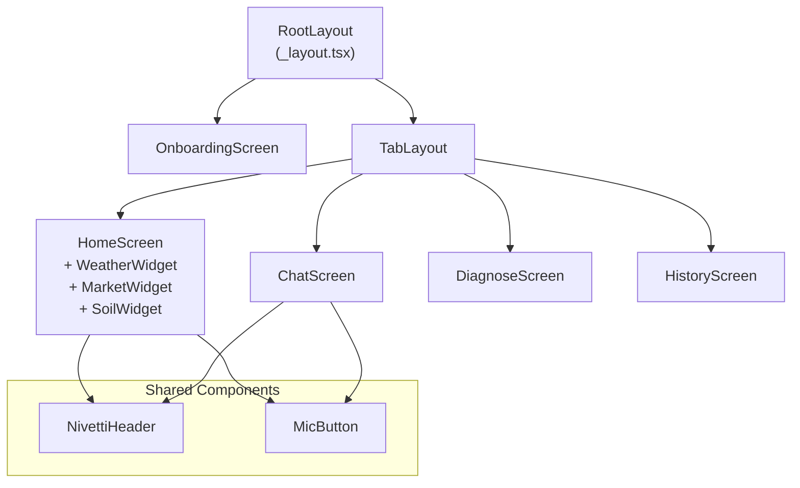

# Low-Level Design (LLD)
## KrishiMitra — Module-Level Technical Design
**Document ID:** KM-LLD-001 | **Version:** 2.0 | **Date:** 2026-05-05  
**Author:** Mohammed Shakeeb | **Organization:** Nivetti Systems

---

## 1. Module Architecture Overview



## 2. Module Deep Dives

### M1: Voice Module (`backend/modules/m1_voice.py`)
**Purpose:** Handles all audio processing — STT (Sarvam AI) and TTS (Sarvam Bulbul v3).

| Function | Signature | Description |
|----------|-----------|-------------|
| `stt_transcribe` | `async (audio_b64: str, mime: str) -> str` | Sends audio to Sarvam STT, returns Kannada transcript |
| `tts_synthesize` | `async (text: str) -> str` | Converts Kannada text to 22kHz WAV audio (base64) |
| `_convert_to_wav` | `(input_path: str) -> str` | FFmpeg M4A/3GP → WAV conversion |
| `_chunk_text` | `(text: str, max_chars: int) -> list[str]` | Splits long text for TTS chunking |
| `_concat_wav_chunks` | `(chunks: list[bytes]) -> bytes` | Proper WAV header parsing and concatenation |

**Critical Design Decisions:**
- Uses `subprocess` ffmpeg instead of pydub (broken in Python 3.13)
- 22kHz sample rate for crisp farmer-friendly audio
- WAV chunk concatenation parses actual `data` sub-chunk headers (not assuming byte 44)
- 15-second timeout per STT/TTS call

### M2: NLP Module (`backend/modules/m2_intent.py`)
**Purpose:** Vocabulary-based intent classification for routing queries.

| Intent | Keywords | Action |
|--------|----------|--------|
| `SF_PREP` | ಜೀವಾಮೃತ, ಬೀಜಾಮೃತ, ಪಂಚಗವ್ಯ | Retrieve preparation steps |
| `SF_APPLY` | ಹಾಕು, ಎಷ್ಟು, ಪ್ರಮಾಣ | Retrieve application rates |
| `SF_MULCH` | ಮಲ್ಚಿಂಗ್, ಹಸಿರೆಲೆ, ಗ್ಲಿರಿಸಿಡಿಯಾ | Retrieve mulching guidance |
| `SF_SOIL` | ಮಣ್ಣು, pH, ಎರೆಹುಳು | Retrieve soil management |
| `SF_COW` | ಹಸು, ಗೋಮೂತ್ರ, ಸಗಣಿ | Retrieve cow-based inputs |
| `DIAGNOSE` | ರೋಗ, ಕೀಟ, ಎಲೆ ಹಳದಿ | Route to diagnosis pipeline |

**Design Note:** Phase 1 uses keyword matching. Phase 2 will introduce scikit-learn ML classifier.

### M3: RAG Module (`backend/modules/m3_rag.py`)
**Purpose:** Retrieval-Augmented Generation using Supabase pgvector.

| Function | Signature | Description |
|----------|-----------|-------------|
| `retrieve` | `async (query: str, category: str, crop: str, top_k: int) -> list[dict]` | Embeds query, calls `match_chunks` RPC |
| `_embed_query` | `(text: str) -> list[float]` | Generates 768-dim embedding via sentence-transformers |

**Key Parameters:**
- Embedding model: `paraphrase-multilingual-mpnet-base-v2` (768 dimensions)
- Similarity threshold: 0.60 (tuned for Kannada cross-lingual retrieval)
- Top-K: 5 chunks per query
- HNSW index: m=16, ef_construction=64

### M4: Diagnosis Module (`backend/modules/m4_diagnosis.py`)
**Purpose:** Image-based plant disease identification using Pixtral-12b.

**Pipeline:** Image → Compress (800px) → Pixtral prompt (JSON schema) → Parse → Chemical filter → Return

**Output Schema:**
```json
{
  "plant_health_status": "DISEASED",
  "disease_name": "Leaf Blight",
  "disease_name_kn": "ಎಲೆ ಸುಟ್ಟ ರೋಗ",
  "confidence_pct": 85,
  "visual_symptoms": ["ಎಲೆ ಹಳದಿ", "ಕಂದು ಚುಕ್ಕೆ"],
  "organic_treatments": ["ನೀಮ್ ಎಣ್ಣೆ ಸಿಂಪರಣೆ"],
  "prevention_measures": ["ಬೆಳೆ ಬದಲಾವಣೆ"]
}
```

### M5: Response Module (`backend/modules/m5_response.py`)
**Purpose:** LLM-powered response synthesis using Mistral Small.

**System Prompt Design:**
- Persona: Wise elder farmer ("ಹಿರಿಯ ರೈತ") with 40 years experience
- Language: Kannada only for farmer-facing text
- Grounding: Must use RAG chunks as source material
- Chemical filter: Blocklist of 13+ chemical inputs
- Response length: Dynamic (short for simple Q, detailed for procedures)

### M6: Guard Module (`backend/modules/m6_guard.py` + `m4_confidence_guard.py`)
**Purpose:** Hallucination prevention and confidence scoring.

**Scoring Algorithm:**
```
Score = SKB_score (0-50) + RAG_score (0-30) + KG_score (0-10) + Cross_validation (0-10)
```

| Score Range | Action |
|------------|--------|
| 0 | Chemical detected → Block + redirect KVK |
| < 50 | Low confidence → Block + redirect KVK |
| 50-69 | Medium → Block if no SKB match |
| 70-100 | High → Deliver response |

### M7: Ingest Module (`backend/modules/m7_ingest.py`)
**Purpose:** ETL pipeline for knowledge corpus.

**Sources Supported:**
- PDF documents (PyMuPDF extraction)
- YouTube transcripts (yt-dlp)
- Manual JSON chunks (structured KB)

**Pipeline:** Source → Extract text → Chunk (500 chars, 100 overlap) → Embed (768-dim) → Store in `document_chunks` table

## 3. API Router Specifications

### New External API Routers

| Router | File | Endpoints | External API | Cache TTL |
|--------|------|-----------|-------------|-----------|
| Weather | `weather.py` | `GET /api/weather`, `GET /api/weather/agriculture`, `GET /api/weather/districts` | Open-Meteo | 1hr / 6hr |
| Soil | `soil.py` | `GET /api/soil`, `GET /api/soil/zone/{id}`, `GET /api/soil/zones` | SoilGrids ISRIC | 24hr |
| Market | `market.py` | `GET /api/market/prices`, `GET /api/market/commodities`, `GET /api/market/districts` | Data.gov.in + curated JSON | 6hr |

## 4. Mobile Component Hierarchy



## 5. Error Handling Strategy

| Layer | Strategy | Timeout |
|-------|----------|---------|
| Mobile → Backend | axios interceptor, retry once, show Kannada error | 60s (query), 120s (diagnosis) |
| Backend → Sarvam | httpx async, catch timeout, return error message | 15s |
| Backend → Mistral | httpx REST call, catch timeout, return fallback | 30s |
| Backend → Pixtral | httpx, catch timeout, suggest retake photo | 50s |
| Backend → Open-Meteo | httpx, catch timeout, return cached/null | 10s |
| Backend → SoilGrids | httpx, catch timeout, return local zone data only | 15s |
| Full Pipeline | asyncio.wait_for hard cap | 45s |
