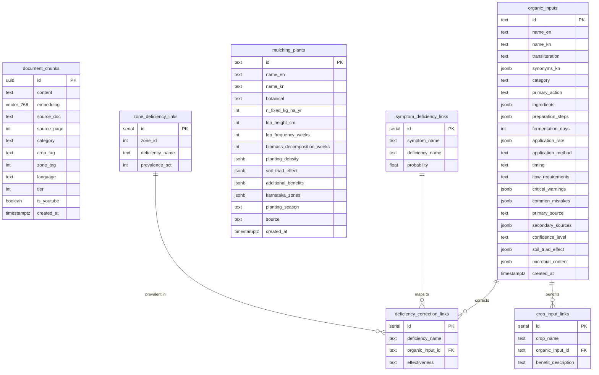

# Database Design Document (DDD)
## KrishiMitra — Supabase/PostgreSQL Schema
**Document ID:** KM-DDD-001 | **Version:** 2.0 | **Date:** 2026-05-05  
**Author:** Mohammed Shakeeb | **Organization:** Nivetti Systems

---

## 1. Entity-Relationship Diagram



## 2. Table Documentation

### 2.1 `document_chunks` — Core RAG Table
**Purpose:** Stores chunked, embedded text from verified agricultural sources for vector similarity search.

| Column | Type | Constraints | Description |
|--------|------|-------------|-------------|
| `id` | `uuid` | PK, default `gen_random_uuid()` | Unique chunk identifier |
| `content` | `text` | NOT NULL | The text chunk (max ~500 chars) |
| `embedding` | `vector(768)` | NOT NULL | Sentence-transformer embedding |
| `source_doc` | `text` | NOT NULL | Source document name (e.g., "ICAR_Organic_Guide_2023") |
| `source_page` | `int` | nullable | Page number in source PDF |
| `category` | `text` | NOT NULL | Topic category (SF_PREP, SF_APPLY, SF_MULCH, etc.) |
| `crop_tag` | `text` | nullable | Specific crop if applicable |
| `zone_tag` | `int` | nullable | Karnataka zone ID (1-10) |
| `language` | `text` | default 'en' | Content language |
| `tier` | `int` | default 1 | Source reliability tier (1=highest) |
| `is_youtube` | `boolean` | default false | Whether from YouTube transcript |
| `created_at` | `timestamptz` | default now() | Insertion timestamp |

**Index:** HNSW on `embedding` column with `vector_cosine_ops`, m=16, ef_construction=64.

### 2.2 RPC Function: `match_chunks`

```sql
match_chunks(
    query_embedding vector(768),
    match_threshold float DEFAULT 0.7,
    match_count int DEFAULT 5,
    filter_category text DEFAULT NULL,
    filter_crop text DEFAULT NULL
) RETURNS TABLE (id, content, source_doc, source_page, category, similarity)
```
Uses cosine distance (`<=>`) for similarity calculation.

## 3. Data Volume Estimates

| Table | Current Rows | Projected (6 months) | Row Size |
|-------|-------------|---------------------|----------|
| `document_chunks` | ~88 | ~500 | ~3KB (768 floats + text) |
| `organic_inputs` | ~15 | ~50 | ~2KB |
| `mulching_plants` | ~8 | ~20 | ~1KB |
| `symptom_deficiency_links` | ~30 | ~100 | ~100B |

## 4. Migration Strategy

| Version | Migration File | Changes |
|---------|---------------|---------|
| v1.0 | `krishimitra_supabase_schema.sql` | Initial schema, pgvector extension, HNSW index |
| v1.1 | (inline) | Drop+recreate `match_chunks` for uuid return type |
| v2.0 | (planned) | Add weather cache table, market price history |

## 5. Backup & Recovery

| Strategy | Implementation |
|----------|---------------|
| **Automatic Backups** | Supabase manages daily backups (free tier: 7-day retention) |
| **Schema Export** | `krishimitra_supabase_schema.sql` in repo root |
| **Data Export** | Structured JSON files in `backend/corpus/structured/` |
| **Seed Data** | Ingest script `backend/scripts/ingest_structured_kb.py` |
