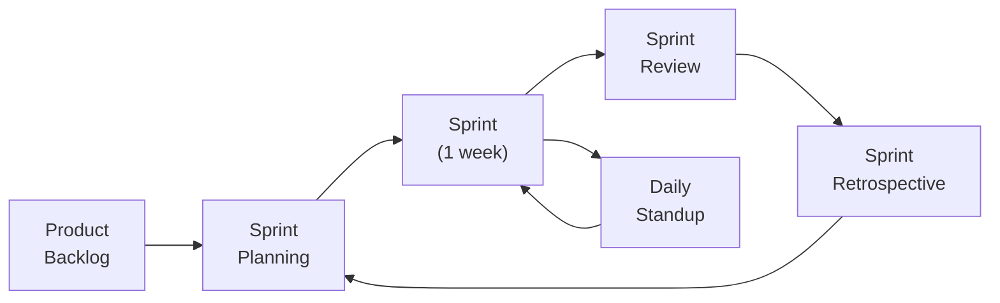
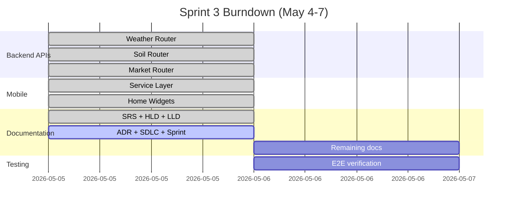

# SDLC & Scrum Process Document
## KrishiMitra — Development Methodology
**Document ID:** KM-SDLC-001 | **Version:** 2.0 | **Date:** 2026-05-05  
**Author:** Mohammed Shakeeb | **Organization:** Nivetti Systems

---

## 1. SDLC Model: Agile/Scrum

KrishiMitra follows **Agile methodology with Scrum framework**, adapted for a small team (4 members) with 1-week sprint cycles and a hard project deadline of **May 7, 2026**.



## 2. Team Structure & RACI Matrix

| Role | Person | Responsibilities |
|------|--------|-----------------|
| **Scrum Master + Backend Lead** | Shakeeb | Sprint planning, backend architecture, M1/M2/M5/M6 modules, API skeleton, mobile integration, documentation |
| **RAG Pipeline Lead** | Rikash | M3 RAG engine, Supabase schema, pgvector setup, benchmark testing (27/30) |
| **Data Curation Lead** | Shinan | Structured KB JSONs (organic_inputs, disease_db, soil_zones, crops), corpus sourcing, domain validation |
| **Mobile Lead** | Shakira | React Native screens, components, services, UX/UI, onboarding flow |

**RACI Matrix:**

| Activity | Shakeeb | Rikash | Shinan | Shakira |
|----------|---------|--------|--------|---------|
| Backend Architecture | R/A | C | I | I |
| RAG Pipeline | C | R/A | C | I |
| Data Curation | I | C | R/A | I |
| Mobile UI | C | I | I | R/A |
| API Integration | R/A | I | I | C |
| Documentation | R/A | C | C | C |
| Testing | R/A | R | C | R |

*R=Responsible, A=Accountable, C=Consulted, I=Informed*

## 3. Sprint Ceremonies

### Sprint Planning (Monday)
- Review product backlog priorities
- Select user stories for the sprint
- Break stories into tasks with hour estimates
- Sprint goal defined

### Daily Standup (15 min, async via WhatsApp)
- What I did yesterday
- What I'm doing today
- Any blockers

### Sprint Review (Saturday)
- Demo working features to team
- Collect feedback
- Update product backlog

### Sprint Retrospective (Saturday, after review)
- What went well (Start/Stop/Continue format)
- Action items for next sprint

## 4. Product Backlog (MoSCoW Prioritization)

| Priority | Category | Items |
|----------|----------|-------|
| **Must Have** | Voice query pipeline, RAG retrieval, Disease diagnosis, Chemical filter |
| **Should Have** | Weather widget, Market prices, Soil data, Session history |
| **Could Have** | Crop calendar, Community forum, Multi-language |
| **Won't Have (Phase 1)** | Offline mode, Government scheme integration, Marketplace |

## 5. Definition of Done (DoD)

A feature is "Done" when:
- [ ] Code is written and compiles without errors
- [ ] Backend endpoint returns correct response (tested via curl)
- [ ] Mobile UI displays data correctly
- [ ] Error handling covers timeout and network failure
- [ ] Kannada text is correct and readable
- [ ] No chemical inputs leak through filter
- [ ] Code is committed with descriptive commit message
- [ ] Peer review completed (for critical modules)

## 6. Definition of Ready (DoR)

A user story is "Ready" for sprint when:
- [ ] Acceptance criteria are defined
- [ ] Dependencies identified (API keys, data, external services)
- [ ] UI mockup exists (even rough sketch)
- [ ] Backend endpoint spec defined

## 7. Branching Strategy

```mermaid
gitgraph
    commit id: "initial"
    branch dev
    commit id: "backend skeleton"
    branch feature/shakeeb-backend
    commit id: "M1 voice"
    commit id: "M2 intent"
    commit id: "M5 response"
    checkout dev
    branch feature/rikash-rag
    commit id: "M3 RAG"
    commit id: "benchmark 27/30"
    checkout dev
    merge feature/shakeeb-backend
    merge feature/rikash-rag
    commit id: "integration"
    checkout main
    merge dev
    commit id: "v1.0 release"
    checkout dev
    commit id: "weather API"
    commit id: "soil API"
    commit id: "market API"
    commit id: "documentation"
    checkout main
    merge dev
    commit id: "v2.0 release"
```

**Branch Naming:** `feature/{owner}-{feature}`, `fix/{description}`, `docs/{topic}`

**Commit Message Format:** `type: description` (feat, fix, perf, style, docs, refactor)

## 8. Velocity Tracking

| Sprint | Planned Story Points | Delivered | Velocity |
|--------|---------------------|-----------|----------|
| Sprint 1 (Apr 20-26) | 13 | 10 | 77% |
| Sprint 2 (Apr 27-May 3) | 15 | 12 | 80% |
| Sprint 3 (May 4-7) | 18 | — | In Progress |

**Burndown Template:**


