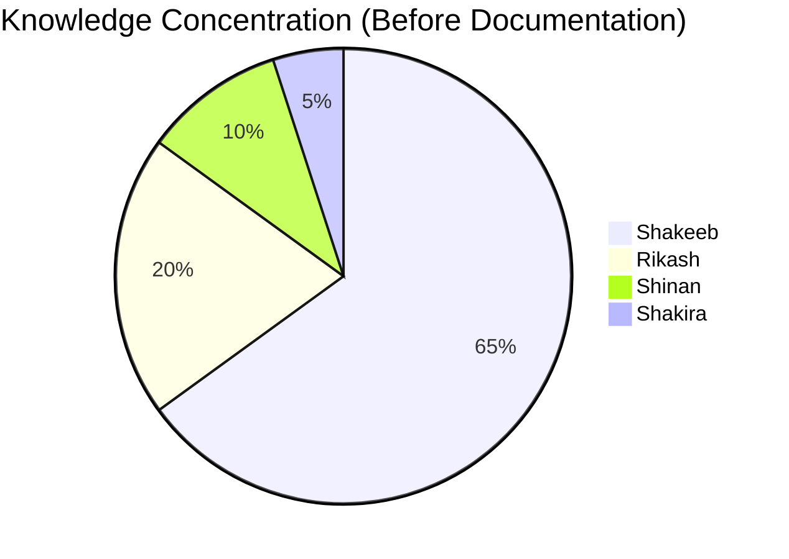
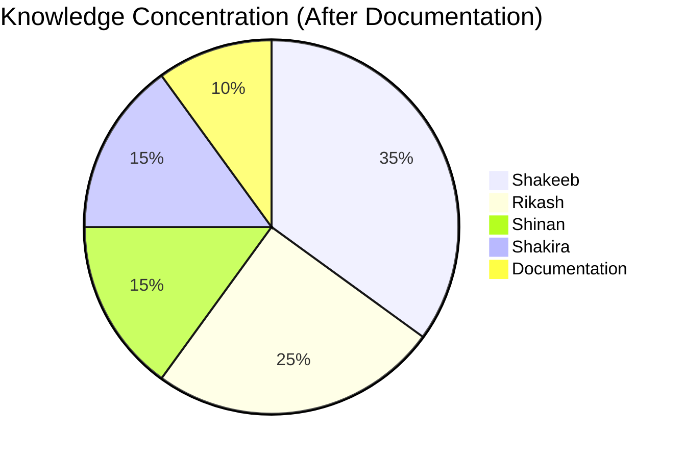

# Risk Register & Bus Factor Analysis
## KrishiMitra — Risk Management
**Document ID:** KM-RISK-001 | **Version:** 2.0 | **Date:** 2026-05-05

---

## 1. Risk Matrix

| ID | Risk | Probability | Impact | Severity | Mitigation | Owner |
|----|------|-------------|--------|----------|-----------|-------|
| R-001 | API key quota exhaustion (Sarvam/Mistral) | High | Critical | 🔴 | Monitor usage, enable billing, have backup keys | Shakeeb |
| R-002 | Single point of failure — Shakeeb | Medium | Critical | 🔴 | This documentation suite, pair programming, code reviews | Team |
| R-003 | Supabase free tier limits | Medium | High | 🟡 | Monitor row count, upgrade plan if >500MB | Shakeeb |
| R-004 | Incorrect farming advice (hallucination) | Low | Critical | 🟡 | RAG-first architecture, M6 Guard, chemical filter, KVK redirect | Shakeeb |
| R-005 | Sarvam AI service outage | Low | High | 🟡 | Graceful degradation — text-only mode | Shakeeb |
| R-006 | Mobile app crash on older Android | Medium | Medium | 🟡 | Target API 24+, test on low-end devices | Shakira |
| R-007 | Corpus insufficient for rare queries | Medium | Medium | 🟡 | KVK redirect for <0.60 confidence, expand corpus over time | Rikash/Shinan |
| R-008 | Data.gov.in API key delayed >7 days | Medium | Low | 🟢 | Curated JSON fallback already in production | Shakeeb |
| R-009 | SoilGrids API rate limiting | Low | Low | 🟢 | 24-hour cache, local zone data fallback | Shakeeb |
| R-010 | Kannada text quality issues | Medium | Medium | 🟡 | Native speaker review, farmer feedback loop | Team |

## 2. Bus Factor Analysis

### Current State

**Bus Factor: 1** (Shakeeb). If Shakeeb is unavailable, the project stalls.

### Target State (After Documentation)

**Target Bus Factor: 2** (any 2 members can maintain the project).

### Knowledge Concentration Heat Map

| Module | Shakeeb | Rikash | Shinan | Shakira | Documentation |
|--------|---------|--------|--------|---------|---------------|
| M1 Voice | 🟢 Expert | 🔴 None | 🔴 None | 🔴 None | ✅ LLD §2.1 |
| M2 NLP | 🟢 Expert | 🟡 Basic | 🔴 None | 🔴 None | ✅ LLD §2.2 |
| M3 RAG | 🟡 Good | 🟢 Expert | 🟡 Basic | 🔴 None | ✅ LLD §2.3 |
| M4 Diagnosis | 🟢 Expert | 🔴 None | 🔴 None | 🔴 None | ✅ LLD §2.4 |
| M5 Response | 🟢 Expert | 🟡 Basic | 🔴 None | 🔴 None | ✅ LLD §2.5 |
| M6 Guard | 🟢 Expert | 🟡 Basic | 🔴 None | 🔴 None | ✅ LLD §2.6 |
| M7 Ingest | 🟡 Good | 🟢 Expert | 🟢 Expert | 🔴 None | ✅ LLD §2.7 |
| Mobile UI | 🟡 Good | 🔴 None | 🔴 None | 🟢 Expert | ✅ LLD §4 |
| DevOps | 🟢 Expert | 🔴 None | 🔴 None | 🔴 None | ✅ Runbook |
| Domain Knowledge | 🟡 Good | 🟡 Good | 🟢 Expert | 🔴 None | ✅ Onboarding |

## 3. Bus Factor Mitigation Actions

| # | Action | Priority | Status |
|---|--------|----------|--------|
| 1 | Create comprehensive documentation (this suite) | P0 | ✅ Done |
| 2 | Document all architecture decisions (ADRs) | P0 | ✅ Done |
| 3 | Write developer onboarding guide | P0 | ✅ Done |
| 4 | Write deployment runbook with step-by-step instructions | P0 | ✅ Done |
| 5 | Inline code comments on all critical functions | P1 | ✅ Done |
| 6 | Cross-train Rikash on M1 Voice and M5 Response modules | P1 | Planned |
| 7 | Cross-train Shakira on backend API structure | P1 | Planned |
| 8 | Pair programming sessions (2x/week) | P2 | Planned |
| 9 | Record video walkthroughs of critical flows | P2 | Planned |
| 10 | Establish code review process (all PRs need 1 reviewer) | P1 | Planned |

## 4. Succession Planning

### If Shakeeb is unavailable:
- **Rikash** takes over backend (guided by LLD + Runbook)
- **Shakira** continues mobile development
- **Shinan** handles corpus expansion and domain validation
- All API keys stored in shared password manager (1Password/Bitwarden)

### If Rikash is unavailable:
- **Shakeeb** handles RAG pipeline (already has Good knowledge)
- Corpus updates managed by Shinan

### Critical Information Not to Lose:
1. **API Keys** — Stored in .env (never committed). Backup in team password manager.
2. **Supabase Credentials** — Same as above.
3. **RAG Threshold Tuning** — 0.60 is optimal for Kannada cross-lingual. Document in ADR.
4. **WAV Parsing Bug** — Do NOT assume WAV data starts at byte 44. Use proper chunk parsing.
5. **SQLITE_FULL Fix** — Zustand `partialize` excludes audio_base64. Don't regress.

## 5. Dependency Risk Assessment

| Dependency | Risk if Unavailable | Fallback |
|-----------|-------------------|----------|
| Sarvam AI | Voice features broken | Text-only mode |
| Mistral AI | Response generation broken | Pre-cached common answers |
| Pixtral-12b | Diagnosis broken | Redirect to KVK |
| Supabase | RAG broken | Local structured KB only |
| Open-Meteo | Weather widget empty | Show "data unavailable" |
| SoilGrids | Soil widget partial | Local zone data only |
| Data.gov.in | Market uses curated data | Already using curated fallback |
